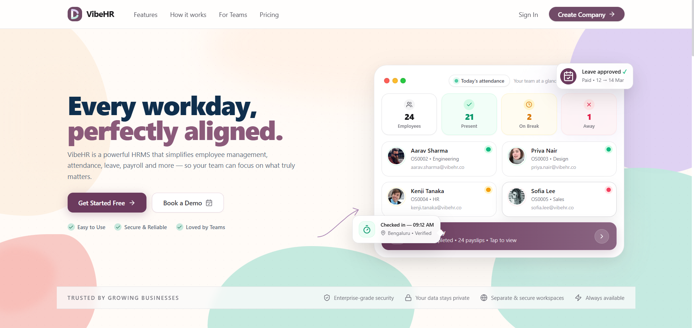

# Staflo

Staflo is a multi-tenant human resource management system for employee records, attendance, leave, payroll, documents, meetings, and workforce reporting. It combines a React web application with a FastAPI API and Supabase-backed PostgreSQL and Storage.

## Product Preview



The landing page highlights Staflo's workforce management experience: streamlined employee attendance tracking, attendance summaries, and an HR-friendly dashboard designed for modern companies.

## Highlights

- Company registration and JWT authentication with email or employee ID login.
- Role-aware access for administrators, HR users, and employees.
- Company-scoped employee directory with invitations and generated IDs such as `OS0001`.
- Employee profiles, avatars, resumes, private information, salary information, and documents.
- Attendance check-in/check-out with geolocation, IP capture, work-hour calculation, and status rules.
- Paid, sick, and unpaid leave requests with employee calendars and HR approval queues.
- Salary components, payroll calculation, salary slips, deductions, and payroll warnings.
- Workforce reports for attendance, leave, and payroll metrics.
- Notifications, internal meetings, Google Meet integration hooks, intern management, and HR chatbot routes.
- Supabase Storage integration with a local uploads fallback for development.

## Technology

| Layer | Technologies |
| --- | --- |
| Frontend | React 18, TypeScript, Vite, Tailwind CSS, React Router, TanStack Query, Zustand, React Hook Form, Zod, Lucide |
| Backend | FastAPI, Python, Pydantic v2, SQLAlchemy 2, asyncpg, Alembic, python-jose |
| Data and storage | PostgreSQL, Supabase Database, Supabase Storage |
| Local orchestration | Docker Compose with PostgreSQL 15 |

## Quick Start

### Prerequisites

- Node.js 18+ and npm
- Python 3.11+ and `pip`
- PostgreSQL, or Docker Desktop/Engine
- A Supabase project for hosted database and file storage features

### 1. Configure the backend

```bash
cd backend
cp .env.example .env
python -m venv .venv
source .venv/bin/activate
pip install -r requirements.txt
```

Set `DATABASE_URL`, `SUPABASE_URL`, `SUPABASE_ANON_KEY`, `SUPABASE_SERVICE_KEY`, and `SECRET_KEY` in `backend/.env`. Add SMTP values only when email delivery is required. Never expose `SUPABASE_SERVICE_KEY` to the frontend.

### 2. Start the API

```bash
cd backend
source .venv/bin/activate
uvicorn app.main:app --reload
```

The API is available at `http://localhost:8000`. Interactive Swagger documentation is at `http://localhost:8000/docs`, and the health endpoint is `http://localhost:8000/health`.

The API creates SQLAlchemy tables during startup for local development. Alembic configuration and the initial Supabase SQL migration are also included for managed database workflows.

### 3. Configure and start the frontend

```bash
cd frontend
cp .env.example .env
npm install
npm run dev
```

The Vite app runs at `http://localhost:5173`. Set `VITE_API_URL` to the API prefix, normally `http://localhost:8000/api/v1`, plus the public Supabase URL and anon key.

### Docker Compose

To run the backend, frontend, and local PostgreSQL service together:

```bash
docker compose up --build
```

Compose exposes the API on port `8000`, the frontend on port `5173`, and PostgreSQL on port `5432`. Create `backend/.env` before starting because the backend service loads that file.

## Environment Files

- `.env.example` points to the two service-specific templates.
- `backend/.env.example` documents database, Supabase, JWT, CORS, and SMTP settings.
- `frontend/.env.example` documents the API URL and public Supabase settings.
- Real `.env` files, credentials, keys, and secrets are excluded by `.gitignore`.

## API Areas

All application routes are mounted below `/api/v1`:

| Area | Router |
| --- | --- |
| Authentication | `auth.py` |
| Users and profiles | `users.py`, `avatars.py` |
| Attendance | `attendance.py` |
| Leave and balances | `leave.py` |
| Payroll | `payroll.py` |
| Documents | `documents.py` |
| Reports and salary slips | `reports.py` |
| Companies | `companies.py` |
| Notifications | `notifications.py` |
| Meetings | `meetings.py` |
| Interns | `interns.py` |
| HR chatbot | `chatbot.py` |

## Project Structure

```text
Staflo/
├── backend/
│   ├── app/
│   │   ├── core/             # Settings, dependencies, and security
│   │   ├── db/               # Async SQLAlchemy engine and base
│   │   ├── models/            # Company, user, attendance, leave, payroll, etc.
│   │   ├── routers/           # FastAPI route modules mounted under /api/v1
│   │   ├── schemas/           # Pydantic request and response schemas
│   │   └── services/          # Payroll, attendance, storage, mail, and integrations
│   ├── alembic/               # Database migration configuration
│   ├── tests/                 # Backend tests
│   ├── seed.py                # Development seed data and salary defaults
│   ├── requirements.txt
│   └── Dockerfile
├── frontend/
│   ├── src/
│   │   ├── api/               # Axios API client
│   │   ├── components/        # Layout, chatbot, communication, and UI primitives
│   │   ├── lib/               # Supabase client and shared utilities
│   │   ├── pages/             # Public and authenticated application screens
│   │   └── stores/            # Zustand authentication state
│   ├── public/                # Static assets
│   ├── package.json
│   └── Dockerfile
├── supabase/migrations/       # Supabase SQL schema migration
├── docs/                      # Keys and requirements traceability
├── docker-compose.yml         # Full local stack
├── Add ons.md                 # Planned and integrated add-on requirements
└── README.md
```

## Development Commands

### Frontend

```bash
npm run dev       # Start Vite development server
npm run build     # Type-check and create production build
npm run preview   # Preview the production build
npm run lint      # Run ESLint
```

### Backend

```bash
uvicorn app.main:app --reload
pytest
alembic upgrade head
```

## Payroll Defaults

The included seed workflow supports common components such as Basic at 40% of wage, HRA at 20%, fixed Conveyance, Special Allowance, PF at 12% of Basic, and Professional Tax at `200`. Components can be fixed amounts or percentages of wage/basic, and payroll calculation reports warnings when earnings exceed the configured wage.

## Employee IDs and Access

Employee IDs are generated from initials and a company-local sequence, for example `Olive System` becomes `OS0001`. Employees can manage their permitted profile details and view their own payroll data; administrators and HR users can manage company employees, approvals, and salary structures.

## Security Notes

- Use a long, random `SECRET_KEY` in every non-development environment.
- Keep Supabase service-role credentials server-side only.
- Configure production CORS origins instead of using broad development origins.
- Do not commit `.env` files, API keys, SMTP credentials, or uploaded private documents.

## Documentation

- [Keys and integrations checklist](docs/KEYS_NEEDED.md)
- [Requirements traceability](docs/TRACEABILITY.md)
- [Supabase migration](supabase/migrations/001_init.sql)
